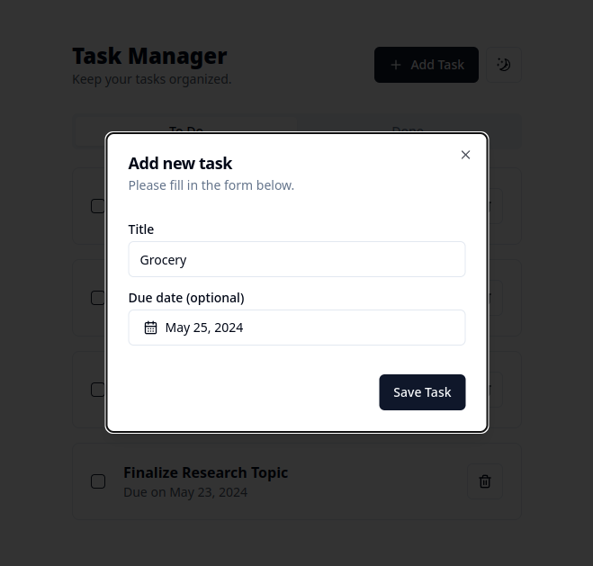
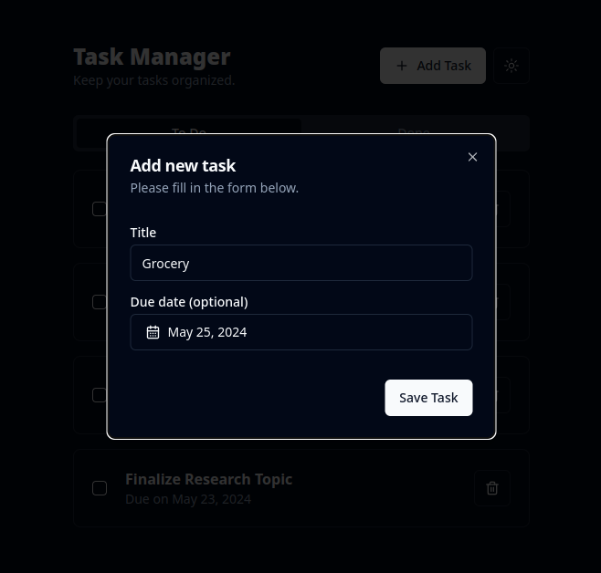

# Task Manager

Simple todo list web application.

## **Tech Stack Used**


## **Setup**
```
git clone https://github.com/NoelEmaas/task-manager.git
cd task-manager
```
Setup server:
```
cd server
npm install
cat sample.env > .env # Then modify the values in the .env
npm run dev
```

Setup client:
```
cd client
npm install
npm run dev
```

## **Previews**

|Task List (Light)|Task List (Dark)|
|--|--|
|||

|Create Task (Light)|Create Task (Dark)|
|--|--|
|||

|Confirm Delete (Light)|Confirm Delete (Dark)|
|--|--|
|||
